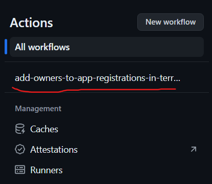
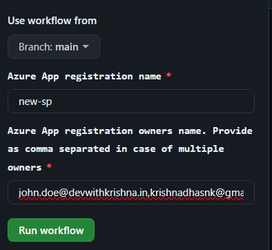

# azure-add-owners-to-app-registations-from-ui
add owners to azure app registrations from github workflow

# How code works

* This repo uses terraform to add owners to a app registration created in Azure.

# parameters used

| input name | description | type | mandatory |
|------------|------------|-----|-------------|
| app_registration_name | Azure App registration name | string | :heavy_check_mark: |
| app_registration_owner | App registration owners names | string | :heavy_check_mark: |

# Terraform commands and How to run the code locally

1. Clone the repo and switch to the folder
2. cd azure-add-owners-to-app-registations-from-ui
3. Then run `terraform init`
4. run `terraform validate`
5. then `terraform plan`
6. then `terraform apply`

## Conditions 

* Need a app registation existing in Azure portal
* We wont be able to add same owner multiple times
* Azure active directory user shuld have a proper mail id available
  
# How to run as a github workflow

1. Go to your cloned repo and then to actions tab

    
2. Choose the workflow `add_owner_to_app_registration.yaml` on left side
   
3. Next click on `Run Workflow` and enter the input parameters required
   
    

4. Click on `Run Workflow`

5. After the job is completedd, The owners will be added to app registration

# Credentials needed

**authentication to azure is done using service principal**

```
env:
    ARM_CLIENT_ID: ${{ secrets.OWNER_SP_APP_ID }}
    ARM_CLIENT_SECRET: ${{ secrets.OWNER_SP_APP_SECRET }}
    ARM_TENANT_ID: ${{ secrets.AZURE_TENANT_ID }}
    ARM_SUBSCRIPTION_ID: ${{ secrets.AZURE_SUBSCRIPTION_ID }}
```

`ARM_CLIENT_ID`, `ARM_CLIENT_SECRET`, `ARM_TENANT_ID`, `ARM_SUBSCRIPTION_ID` are required Environment variables.

I used Github secrets on the workflow for authentication.

Reference - [using-secrets-in-github-actions](https://docs.github.com/en/actions/security-guides/using-secrets-in-github-actions)

####` Refer [configuring-the-service-principal-in-terraform](https://registry.terraform.io/providers/hashicorp/azurerm/latest/docs/guides/service_principal_client_secret#configuring-the-service-principal-in-terraform)